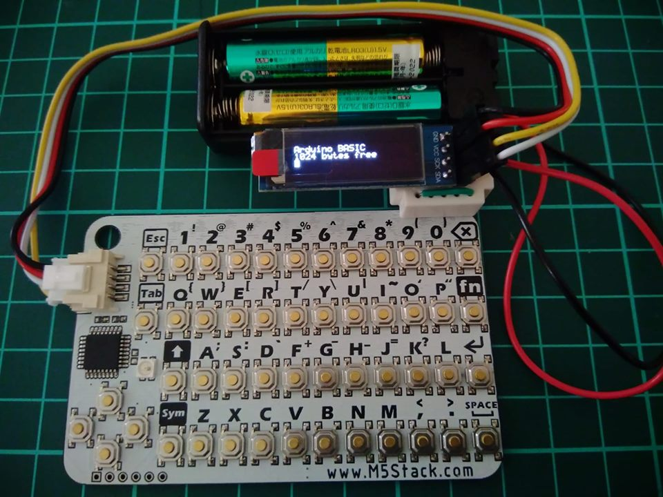
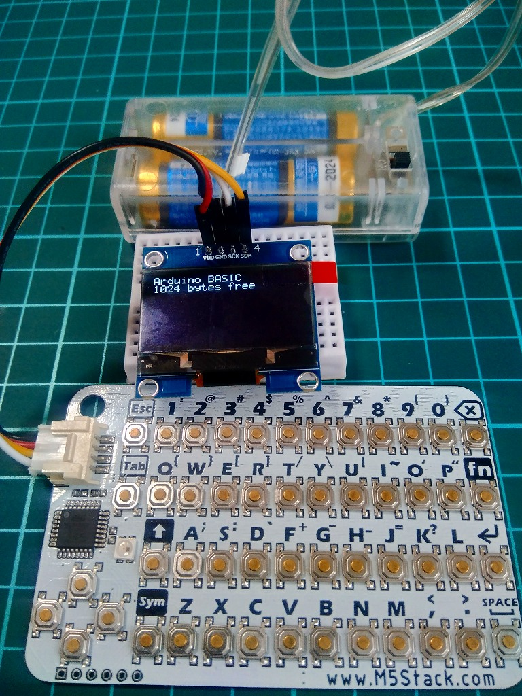

# CardKeyBoardでArduinoBasicが動作する自作ポケコン
[M5stak](https://m5stack.com/)用のCardKeyBoardとI2CのOLED(128x32)で、Robin Edwardsさんの[ArduinoBasic](https://github.com/robinhedwards/ArduinoBASIC)が動く自作ポケコンです。80年代の家庭用コンピューターで使われていたBasic言語を実行することができます。<br>
[](https://youtu.be/O71nmI2AG5k)

## ToDo
-なし

## 【修正履歴】
### イメージ表示(IMG)コマンドを修正しました
8×6サイズのイメージを表示できるIMGコマンドを修正しました。データは16進数で定義します。<br>
表示の際は、position x,y(x,y座標は0始まりです)コマンドで表示位置を指定してください。<br>
例）<br>
以下のイメージをimgコマンドを使ってプログラムする場合<br>
□□□□□□<br>
□□□□□□<br>
□□□□□■<br>
□□□□■□<br>
□□□■□□<br>
□□■□□□<br>
□■□□□□<br>
■□□□□□<br>
```
10 position 0,0
20 IMG "010204081020"
```
### Adafruit NeoPixelライブラリを廃止しました
軽量のフルカラーLEDライブラリ[light_ws2812 V2.4](https://github.com/cpldcpu/light_ws2812)へ変更しました。

### PRINT関数の表示を改善しました
PRINT関数で画面右下の描画をした際、1行スクロールしていたのをスクロールしないよう改善しました。

### DIRコマンドの表示を改善しました
DIRコマンド実行時に画面がスクロールしてファイル名が見えない問題を改善しました。画面スクロールの手前で表示を止めています。何かキーを押すと1行スクロールします。※ESCキーでキャンセルや、上下へのスクロールの対応はありません。

### キーボードおよびINKEY$関数を改善しました
キーリピートに対応しました。また、INKEY$を使用した場合、キーを押してもプログラムが止まりません。あと、shiftキー、fnキー、Symキーを長押しすると、連続入力モードになります。解除するには、もう一度shiftキー、fnキー、Symキーを軽く押してください。

### GPIO関連命令を廃止しました
cardKBのキーボードで使用するGPIOと競合するため、PIN,PINMODE,PINREAD,ANALOGRDの使用を廃止しました。理解した上で使用する場合は、basic.hの下記の箇所を修正してください。<br>
```
//GPIO 1...USE GPIO   0...GPIO NONE
#define GPIO                    0

  ↓↓

#define GPIO                    1
```

### 三角関数に対応しました
RADですがSIN、COS、TAN、それと、EXPとSQRTも追加しました。

### EEPROMに対応しました
EEPROM(24LC256など)を使用する場合、host.hを以下のように0から1へ書き換えてください。<br>
```
#define EXTERNAL_EEPROM         0

  ↓↓

#define EXTERNAL_EEPROM         1
```
初回、EEPROMを使用する場合コメントを外して実行するとEEPROMが初期化されます。初期化後は元に戻してください。コメントを戻さない場合、毎回初期化されます。
```
  // IF USING EXTERNAL EEPROM
  // The following line 'wipes' the external EEPROM and prepares
  // it for use. Uncomment it, upload the sketch, then comment it back
  // in again and upload again, if you use a new EEPROM.
  // writeExtEEPROM(0,0); writeExtEEPROM(1,0);

  ↓↓

     writeExtEEPROM(0,0); writeExtEEPROM(1,0);
```
## 1.3インチ I2C OLED 128×64に対応しました
SSD1306ASCII_I2C.hを以下のように修正してください。<br>
注意：0.96インチ I2C OLED 128×64は128×32として動作を想定しています。<br>
```
#define OLED_WIDTH  128
//#define OLED_HEIGHT 32
#define OLED_HEIGHT 64

#define OLED_COLMAX 21
//#define OLED_ROWMAX 4
#define OLED_ROWMAX 8
```


## 【コンパイルの際の注意事項】
- SSD1306ASCII、light_WS2812は「\Arduino\libraries」フォルダー配下に入れてください。
- コンパイルの際は下図のようにATmega328p(3.3V,8Mhz)を選択してください。選択しない場合、NeoPixel LEDが白色で点灯したままになります。<br><br>
- バイナリは下図から作成できます<br><br>
- avrdudeやavrdude-GUI等のツールを使ってコンパイルしたバイナリを書き込んでください。

### ヒューズビット
初期値のまま書き換えないでください。<br>
<br>

